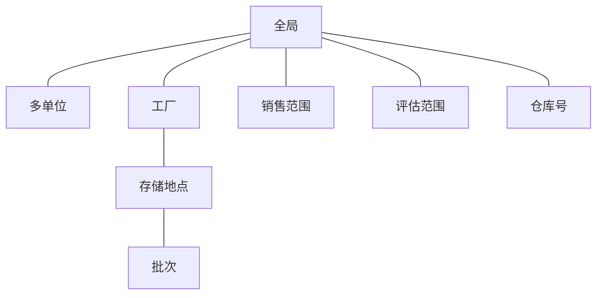

# MM组织架构

概述 该部分基本都为必须配置

### 定义

#### 定义工厂

​	路径:SPRO->企业结构->定义->常规->定义, 复制, 删除, 检查工厂

​	建议:使用复制功能创建新的工厂,创建后用定义功能修改名称,地址等信息.

-   复制功能在创建一个新工厂的同时,会同步配置大概160张相关配置表.

-   零售系统中需要每个CLIENT需要用WB01创建工厂,此处的默认复制规则大概只会复制不到60个配置点.足够MM/SD常规使用.若要启用PP(PM/PS/QM等),建议采用复制功能传输配置,每个业务CLIENT再用WB01将其转换为零售工厂.
-   在转储业务中,工厂需要绑定BP 供应商,客户,装运信息.则需要在配置系统创建该客户\供应商,并分配给工厂.
-   复制功能会创建很多冗余,建议第一个复制0001工厂到新工厂(例如0010),删除该工厂的仓储地点,装运点分配等冗余信息,实际业务工厂再使用该工厂作为蓝本复制.
-   S4的版本必须为工厂启用分类账,事务为OMX1/OMX3/CKMSTART.

#### 定义仓储地点

​	路径:SPRO->企业结构->定义->物料管理->维护仓储地点

​	说明:为每个工厂维护仓库编码,地址等信息.

#### 定义采购组织

​	路径:SPRO->企业结构->定义->物料管理->维护采购组织

​	建议:常见的业务实践,两种采购组织模式.决策因素一般从供应商的准入,价格数据的维护,采购组织架构等方面考虑.权限方面一般下沉到采购组控制.

-   集中采购:集团公司创建一个统一的采购组织.
-   分散采购:为每个公司分别创建采购组织.	

#### 定义装运点

​	路径:SPRO->企业结构->定义->后勤执行->定义, 复制, 删除, 检查起运点

​	建议:一般统一创建一个或者按工厂创建.一般启用运输管理时需要细化考虑.

### 分配

#### 为工厂分配公司代码

​	依赖:财务公司代码配置

​	路径:SPRO->企业结构->分配->常规->给公司代码分配工厂

​	建议:必须配置,每个工厂分配一个公司代码

#### 为采购组织分配公司代码

​	路径:SPRO->企业结构->分配->物料管理->给公司代码分配采购组织

​	建议:公司和采购组织1:1时建议配置,参考定义采购组织集中采购/分散采购建议.

#### 给工厂分配采购组织

​	路径:SPRO->企业结构->分配->物料管理->给工厂分配采购组织

​	建议:必须配置,多对多配置,参考定义采购组织集中采购/分散采购建议.

​	若工厂有多个采购组织,则需要配置```给工厂分配标准采购组织```,详见标准说明.

#### 给工厂分配起运点

​	路径:SPRO->企业结构->分配->后勤执行->给工厂分配起运点

​	建议:一般统一创建一个或者按工厂创建.一般启用运输管理时需要细化考虑.	

# MD 物料主数据

## 重要字段信息

### 物料类型

​	路径:SPRO->物流 - 常规->物料主数据->基本设置->物料类型

​	概览:维护物料的屏幕字段参考,号码段,可维护视图,默认的价格控制,默认的数量/价值更新开关,账户分类参考等信息.

​	广义物料概念:区别于一般的库存物料,一些非库存服务项目等虚拟物料一般单独创建物料类型.

​	建议的方案:按物料的业务分类划分或按财务的记账维度划分,例如服装行业面料,辅料,成衣,样衣,零售耗材等.

​	不建议的方案:按产成品,半成品,原材料.扩展性较差,产业链较长的集团公司不适合.

### 物料组

​	路径:SPRO->物流 - 常规->物料主数据->设置关键字段->定义物料组

​	建议:物料的分类,一维配置,只能用字符截断来实现多级配置,长度只有9位,扩展性较差. 基于以上原因,面对多级复杂的分类实现,建议用产品层次字段(总长18位,可定义三层树结构)或者自定义物料组1-5或者自定义字段实现.

​	扩展:可以为物料组配置评估类,在消耗性采购(成本中心,内部订单等)中使用采购组来确定费用科目.

### 定义部门

​	路径:SPRO->物流 - 常规->物料主数据->设置关键字段->定义部门

​	说明:销售范围的组成部分.建议通用一个或者按销售维度的顶层分类设置.例如品牌/销售分类.实际销售下单时可以配置映射逻辑.

### 定义物料状态

​	路径:SPRO->物流 - 常规->物料主数据->设置关键字段->定义物料状态

​	说明:定义物料在材料/BOM/工艺路线/需求计划/生产/库存等环节的可用性.

### 定义存储条件

​	路径:SPRO->物流 - 常规->物料主数据->设置关键字段->定义存储条件

​	说明:装运类型\装运点的确认逻辑用到.

### 定义EAN类型

​	路径:SPRO->物流 - 常规->物料主数据->设置关键字段->国际物品号 (EAN)

​	说明:可实现国标码或者内部条码的管理,支持校验位,支持在号码范围内自动生成国标码.

​	建议:多单位场景下需要为每个单位(规格)生成条码.

### 定义产品层次

​	路径:SPRO->物流 - 常规->物料主数据->设置关键字段->定义产品层次

​	说明:总长度18位,可设置多级树型目录结构.

## 关键配置

### 定义物料编号的输出格式

​	路径:SPRO->物流 - 常规->物料主数据->基本设置->定义物料编号的输出格式

​	建议:勾选辞典编撰的,将所有物料视为字符串,纯数字的物料编号将不会补0.物料长度合适即可,不超过40位.

### 维护物料管理的公司代码

​	路径:SPRO->物流 - 常规->物料主数据->基本设置->维护物料管理的公司代码

### 字段选择

​	路径:SPRO->物流 - 常规->物料主数据->字段选择

​	说明:从行业类型,特定工厂,特定物料类型的字段参考等维度确定物料的必填/隐藏/显示/可选.例如可以实现物料创建必填,修改时显示(不允许修改).

## 物料层级结构



对应的数据结构参考SE36 逻辑数据库 MSM.

## 增强

### 字段增强

​	不建议:

-   不建议直接在MARA增强字段,后续扩展传输风险较大.

-   不建议使用分类扩展,后续业务逻辑实现成本过高.

​	建议:新建一张物料主键的表管理自定义字段.通过视图关联该表和MARA,作为后续程序使用.维护方便,扩展风险较小.

# BP-供应商主数据

​	S4后通过,BP角色扩展客户\供应商变为必选项.

​	建议方案:如无特殊要求,建议BP分组,编码,含义与客户,供应商的账户组,编码保持一致.即客户\供应商需要统筹考虑分组和编码.

## BP基础配置

​	路径:跨应用组件->SAP业务伙伴->业务伙伴->基本设置->商业伙伴角色->定义业务伙伴角色

​	建议:

# ME采购

# MB物料移动


